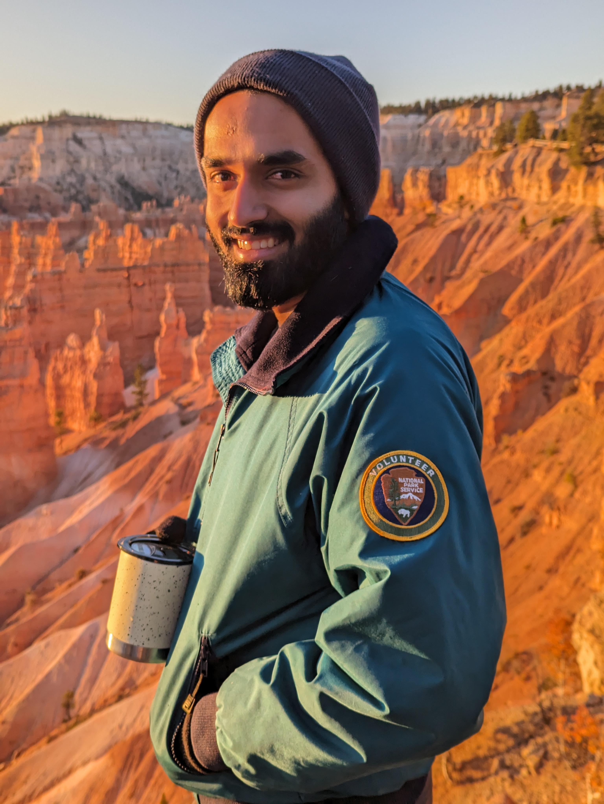

---
# Feel free to add content and custom Front Matter to this file.
# To modify the layout, see https://jekyllrb.com/docs/themes/#overriding-theme-defaults

layout: home
title: Welcome to my website (under construction)!
---

 I'm a fifth-year PhD Candidate in Astrophysics at Caltech, working on understanding galactic magnetic fields and cosmic rays with [Prof. Phil Hopkins](http://www.tapir.caltech.edu/~phopkins/Site/). For my biographical info, click [here](https://samponnada.github.io/about/). An up-to-date-version of my CV (as of May 2024) is linked [here](https://caltech.box.com/s/k6lizvzpcfgi4co9l4jgi6qxb872ti5i). For updates on my research, keep scrolling down below (to be continued)!  

